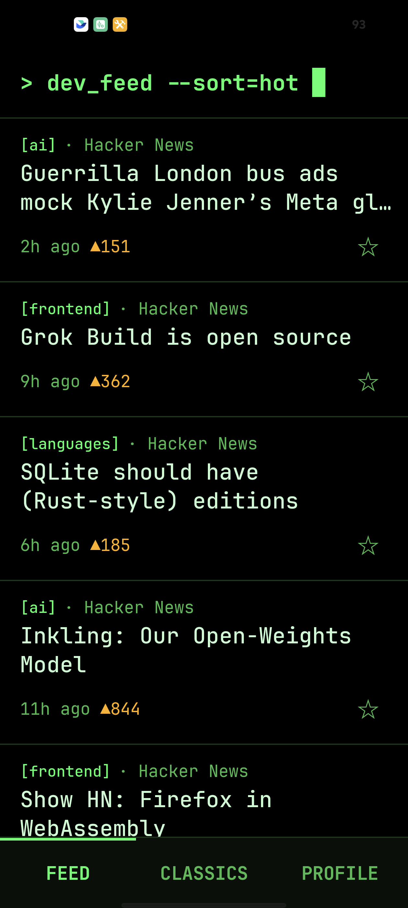
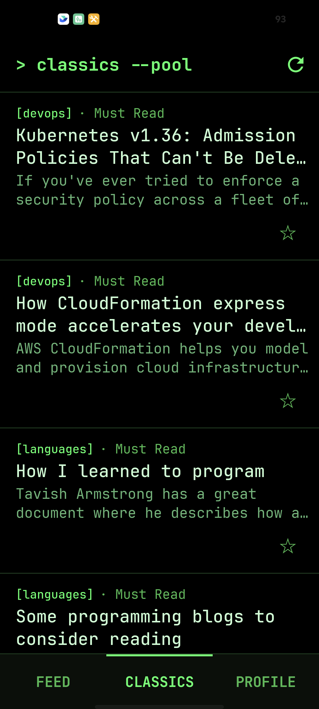
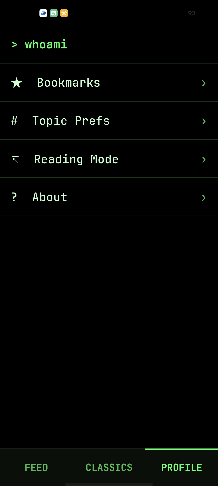

# ReadLater

Personal Android reader for software-development news and evergreen engineering
articles.

## What it does

- Aggregates Hacker News and selected RSS feeds.
- Lets users tune topic preferences and bookmark articles.
- Opens originals through Custom Tabs or the external browser.
- Provides a 480-item offline Classics pool that changes only when the user
  requests the next batch.

## Screenshots

<p align="center">
  <a href="docs/screenshots/feed.png"></a>
  <a href="docs/screenshots/classics.png"></a>
  <a href="docs/screenshots/profile.png"></a>
</p>

Click a screenshot to view the original resolution.

## Build

```bash
./gradlew :app:assembleDebug
./gradlew :app:installDebug
adb shell am start -n com.example.hackernews/.MainActivity
```

## Release build

Release APKs must be signed. Copy `keystore.properties.example` to the ignored
`keystore.properties`, replace its placeholders with your local keystore values,
then run:

```bash
./gradlew :app:assembleRelease
```

The signed APK is written to `app/build/outputs/apk/release/app-release.apk`.
Never commit the keystore or `keystore.properties`.

To manually regenerate the shipped Classics pool, see
[`tools/classics-collector/README.md`](tools/classics-collector/README.md).

## Development documentation

Agent workflow: [`AGENTS.md`](AGENTS.md)

Current work and verification: [`.claude/CURRENT_STATE.md`](.claude/CURRENT_STATE.md)

Architecture: [`.claude/ARCHITECTURE.md`](.claude/ARCHITECTURE.md)
